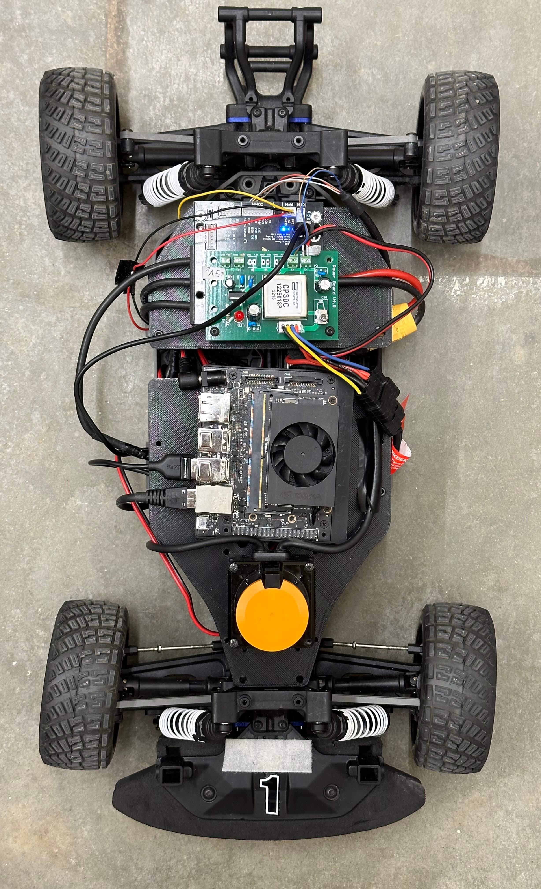
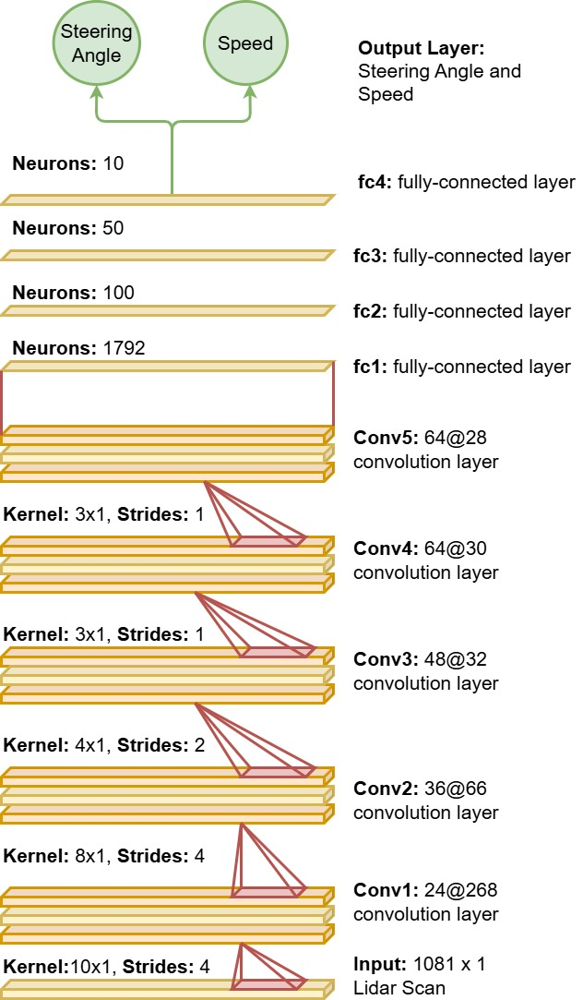

# TinyLidarNet

[](Link_to_Paper)
[](Link_to_Slides)
[](Link_to_Video)
[](https://github.com/zarrar1607/TinyLidarNet/tree/main/Dataset)


https://github.com/zarrar1607/TinyLidarNet/assets/61513813/93315cb2-0ab6-4b75-86f3-f634e1560aa8


## Setup
This repository is designed for use with ROS Noetic. Hardware we use include an NVIDIA Jetson Xavier NX, Hokuyo Lidar UST10-LX, VESC-MKIV, and Logitech F710 Gaming Controller. The operating system used is Linux 5.10.104-tegra aarch64. Follow the steps below to set up the environment:

<div align="center">
    <figure>
        <div>
            
        </div>
        <div>
            <figcaption>Figure 1: F1 Tenth Hardware Setup</figcaption>
        </div>
    </figure>
</div>

## Install Dependcies
Please install:
- ROS Noetic: Install from the official *[official ROS Noetic](https://wiki.ros.org/noetic/Installation/Ubuntu)* and follow the provided instructions.
- TensorFlow: If using an NVIDIA Jetson Xavier NX, install TensorFlow using the JetPack provided by NVIDIA. Follow the instructions on the *[NVIDIA website](https://docs.nvidia.com/deeplearning/frameworks/install-tf-jetson-platform/index.html)*

Clone this repository:
```
git clone https://github.com/zarrar1607/TinyLidarNet.git
```

The ROS_Workspace folder is dedicated to setting up the ROS environment. It follows the standard steps of creating a devel folder, builder folder, and CMakeLists.txt file. Within this folder, you'll find code sourced from the *[f1tenth_system repository](https://github.com/f1tenth/f1tenth_system/tree/melodic)*.

This code has been customized to include a global joystick button functionality for seamless switching between autonomous and manual control modes. Additionally, the ROS laser filter package has been integrated into the system for enhanced sensor data processing.

On the terminal navigate inside the ROS_Workspace folder and execute:
```
cd TinyLidarNet/ROS_Workspace
catkin_make
source devel/setup.bash
```
Next make sure to change the absolute file path in *[TinyLidarNet/ROS_Workspace/src/f1tenth_system/racecar/racecar/launch/teleop.launch](https://github.com/zarrar1607/TinyLidarNet/blob/main/ROS_Workspace/src/f1tenth_system/racecar/racecar/launch/teleop.launch)* for the ros-node "laser_filters" .

Lastly, install python libraries
```
pip install rospy rosbag scikit-learn matplotlib
```
## Reproducing the same Results as in Paper
1. <strong>Dataset Availability:</strong> The dataset used for training the model is located in the Dataset folder. This data was collected during the 12th F1TENTH Competition held in CPS-IOT Week 2023 and is stored as bag files. New dataset can be collected and aggregated with the exsisitng ones, that are provided in this GitHub repository.
2. <strong>Model Training:</strong> The existing model is trained using 85% of the aggregated data from the bag files. To reproduce the results from the paper, follow these steps:
    - Navigate to the *[Inference](#inference)* section to test the existing model.
    - Or you can just train the model using train.py by running and then navigating to *[Inference](#inference)* section.
    ```
    python train.py
    ```
3. Reproducing the Simulation Results: To replicate the simulation results presented in our paper, we leverage the simulation environment provided by BDEvan5, as detailed in their repository - *[link](https://github.com/BDEvan5/f1tenth_benchmarks?tab=readme-ov-file)* accompanying the paper titled - *[Unifying F1TENTH Autonomous Racing: Survey, Methods and Benchmarks](https://arxiv.org/pdf/2402.18558)*. Follow these steps:
    - Refer to the instructions outlined in the *[Repository](https://github.com/BDEvan5/f1tenth_benchmarks/blob/master/README.md)* to set up the necessary environment.
    - Execute the script *[generate_benchmark_results.py](https://github.com/zarrar1607/TinyLidarNet/blob/main/Benchmark/f1tenth_benchmarks/benchmark_results/generate_benchmark_results.py)*. This script utilizes the pretrained models stored in  *[this directory](https://github.com/zarrar1607/TinyLidarNet/tree/main/Benchmark/f1tenth_benchmarks/zarrar)*  to produce benchmark results.
    ```
    python3 generate_benchmark_results.py
    ```
    - After generating the results, visualize them using the Jupyter notebook *[tiny_notebook.ipynb](https://github.com/zarrar1607/TinyLidarNet/blob/main/Benchmark/f1tenth_benchmarks/benchmark_results/tiny_notebook.ipynb)*


By following these steps, you can reproduce the figures and outcomes discussed in our paper.

## Data Collection
Open a terminal and change to the TinyLidarNet directory:
```
cd TinyLidarNet
```
Open a new terminal or pane (you can use tmux or split terminal) and run the following command:
```
roslaunch racecar teleop.launch
```
This will start the f1tenth_system with teleoperation enabled. Use your controller to drive the car around the track.

Open another terminal or pane (or a separate terminal window) and run:
```
python data_collection.py
```
This Python script is responsible for recording data such as lidar scans, speed, and steering, and storing it as ROS bags in the Dataset folder.

- While the data_collection.py script is running, you can start and stop recording data by pressing the X button on your controller.
- Press X to START recording when you're ready to record data.
- Press X again to STOP recording when you want to finish recording.
- After stopping the recording by pressing X again, you can manually press Ctrl+C (SIGINT) in the terminal where data_collection.py is running to terminate the program.
- By deafult the file name of rosbag is out.bag but you can change the filename for recording multiple different bag files and later aggregate that data in train.py

To ensure that data was recorded, you can check the contents of the ROS bag file:
```
rosbag info ./Dataset/<rosbag filename>
```
Replace \<rosbag_filename\> with the actual name of the ROS bag file created during recording (such as out.bag).

### Notes:
- Make sure you have the correct controller connected and configured for teleoperation.
- Confirm that the teleoperation in teleop.launch is working as expected before starting data collection.
- Always ensure the car is in a safe environment when collecting data.
- These steps should help you record the necessary data for your project using the TinyLidarNet setup.
## Model Training
Now, once you are done collecting the data. Stay in the TinyLidarNet directory. Execute the following command to start training the models:
```
python train.py
```
This script will train two models:
- A non-quantized version
- An integer 8-bit quantized version

After training is complete, you can find the trained models in the Models directory within TinyLidarNet. By default the model name is TLN. It can be changed in the global variable section of train.py

Navigate to the Figure folder within TinyLidarNet to view the learning curves of the training process. These figures will provide insights into the model's performance during training.

In the train.py script, there's a section for Global Variables. Within this section, you'll find the variable dataset_path. You can add new dataset files you collected to this path to aggregate them with the previously used dataset. This is particularly useful when using HG-Dagger [[HG-DAgger: Interactive Imitation Learning with Human Experts](https://arxiv.org/abs/1810.02890)].

The train.py script will also generate an evaluation of your trained model, including:
- Losses
- Inference time

This process will allow you to train and evaluate models based on the collected data using the TinyLidarNet setup.

<div align="center">
    <figure>
        <div>
            
        </div>
        <div>
            <figcaption>Figure 2: TinyLidarNet Architecture</figcaption>
        </div>
    </figure>
</div>

## [Inference](#inference)

Stay in TinyLidarNet directory. Open a new terminal or pane (you can use tmux or split terminal) and run the following command:
```
roslaunch racecar teleop.launch
```
In another terminal or pane, execute the inference script:
```
python inference.py
```
This script will initially start in manual mode. You can use your joystick to manually control the car. Press the 'A' button on your joystick to switch to autonomous mode. Press 'A' again to switch back to manual mode.

If you want to implement HG-Dagger [[HG-DAgger: Interactive Imitation Learning with Human Experts](https://arxiv.org/abs/1810.02890)] for continuous learning, use a third terminal or pane to run the data collection script:
```
python data_collection.py
```
Press the 'X' button on your joystick to start collecting data while the car is in autonomous mode. This will collect data for fine-tuning the model using HG-Dagger [[HG-DAgger: Interactive Imitation Learning with Human Experts](https://arxiv.org/abs/1810.02890)].

## Citation
If you have found our work useful, please consider citing:

```
cite
```

